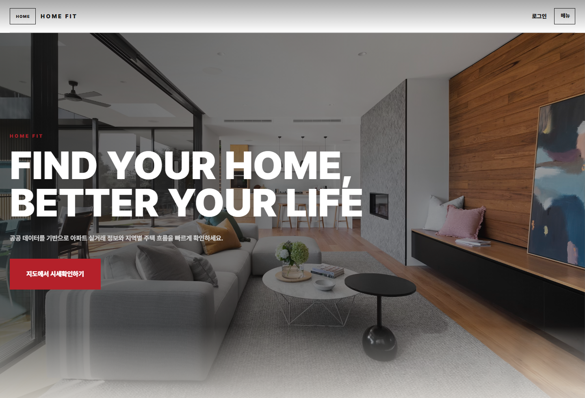
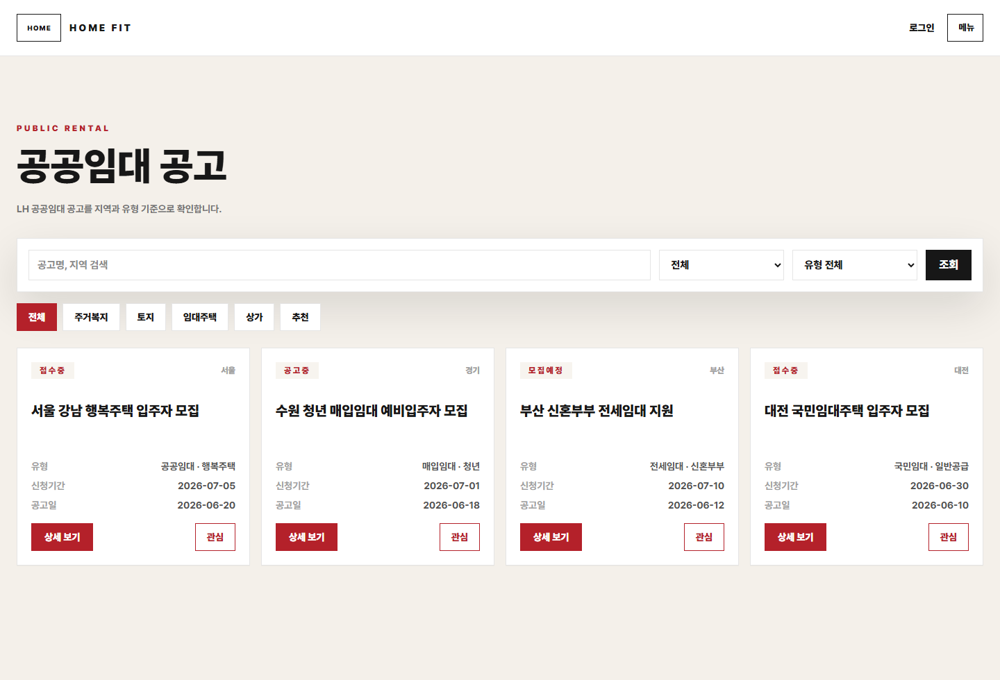
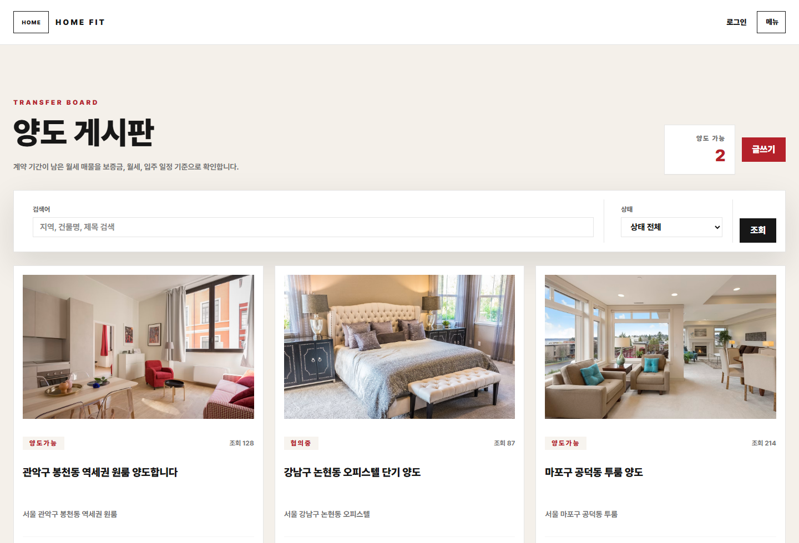
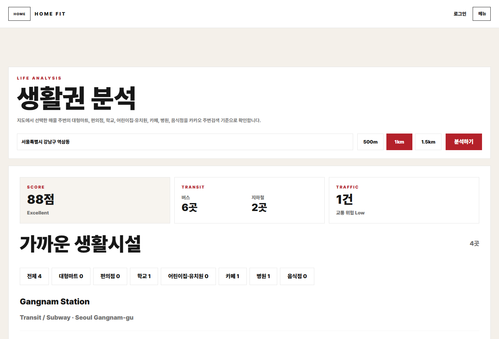

# HOME FIT Frontend

공공데이터 기반 주거 의사결정 플랫폼 **HOME FIT**의 프론트엔드입니다. 아파트 실거래 흐름, LH 공공임대 공고, 양도 게시판, 생활권 분석, 회원 금융 프로필을 하나의 사용자 흐름으로 연결합니다.



## 주요 기능

- **홈 대시보드**: HOME FIT의 핵심 서비스 진입점과 추천 흐름을 한 화면에서 제공합니다.
- **공공임대 공고**: LH 공고를 지역, 유형, 추천 조건 기준으로 탐색하고 관심 공고로 관리합니다.
- **양도 게시판**: 보증금, 월세, 관리비, 양도비, 입주 가능일 기준으로 양도 매물을 비교합니다.
- **생활권 분석**: 선택 위치 주변의 교통, 편의시설, 학교, 병원 정보를 분석합니다.
- **회원/마이데이터**: 사용자 금융 프로필을 기반으로 공공임대 적합성과 추천 공고를 연결합니다.
- **AI 상담 위젯**: 현재 보고 있는 공고나 위치 맥락을 함께 전달해 주거 상담형 답변을 받을 수 있습니다.

## 화면 미리보기

### 공공임대 공고



### 양도 게시판



### 생활권 분석



## 기술 스택

- Vue 3
- Vite
- Vue Router
- Pinia
- TanStack Vue Query
- Axios
- Tailwind CSS
- Vitest
- Playwright

## 프로젝트 구조

```txt
src/
  app/             # 앱 엔트리, 라우터
  pages/           # 페이지 단위 화면
  widgets/         # 앱 내 독립 위젯
  features/        # 기능 단위 UI
  entities/        # 도메인별 API, 모델, 쿼리
  shared/          # 공통 API 클라이언트, 스타일, 유틸, UI
```

## 실행 방법

```sh
pnpm install
pnpm dev
```

기본 개발 서버는 Vite 설정에 따라 로컬에서 실행됩니다.

백엔드 정적 리소스 배포용 빌드는 다음 명령을 사용합니다.

```sh
pnpm build:backend
```

## 환경 변수

백엔드 API 주소는 `VITE_BACKEND_ORIGIN`으로 지정할 수 있습니다. 값이 없으면 기본 배포 백엔드 주소를 사용합니다.

```env
VITE_BACKEND_ORIGIN=https://your-backend.example.com
OPENAPI_KAKAO_JAVASCRIPT_KEY=your-kakao-javascript-key
```

## API 연동

공통 Axios 인스턴스는 `src/shared/api/client.js`에서 관리합니다. `VITE_BACKEND_ORIGIN`을 기준으로 `/api` base URL을 만들고, 인증이 필요한 요청에는 저장된 access token을 Bearer 토큰으로 자동 첨부합니다.

| 기능 | 주요 API |
| --- | --- |
| 공공임대 공고 | `/api/rentals` |
| 공공임대 추천 | `/api/rentals/recommendations` |
| 양도 게시판 | `/api/transfers` |
| 양도 댓글 | `/api/transfers/{transferId}/comments` |
| 생활권 분석 | `/api/analysis` |
| 대출 분석 | `/api/loans/property-analysis` |
| AI 상담 | `/api/ai/chat` |
| 회원/금융 프로필 | `/api/members/*` |

## 검증 명령

```sh
pnpm build
pnpm test:unit
pnpm lint
```

단위 테스트는 Vitest와 Vue Test Utils를 사용하고, E2E 시나리오는 Playwright로 실행합니다.

## 주요 라우트

- `/` 홈
- `/prices` 실거래가 지도
- `/rentals` 공공임대 공고
- `/lh-calendar` LH 캘린더
- `/transfers` 양도 게시판
- `/analysis` 생활권 분석
- `/member` 마이페이지
